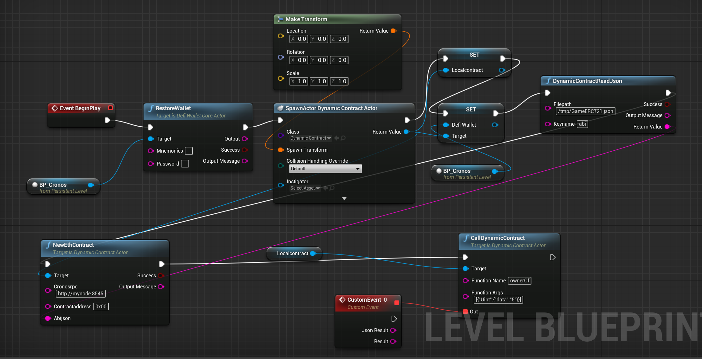
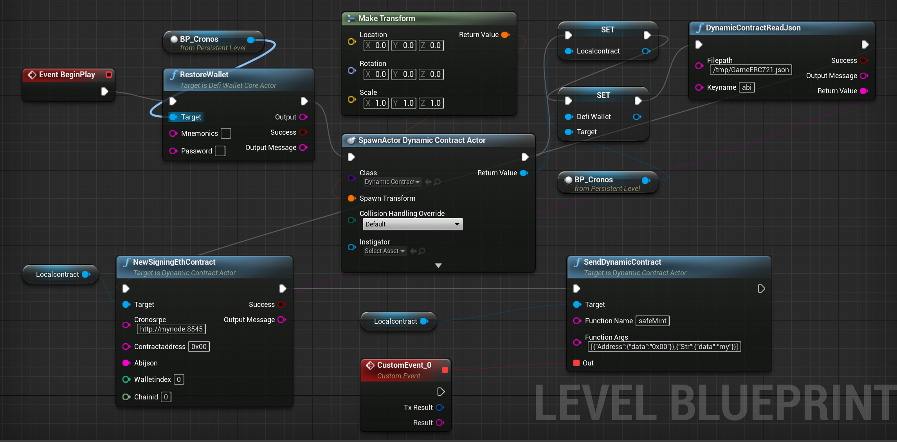
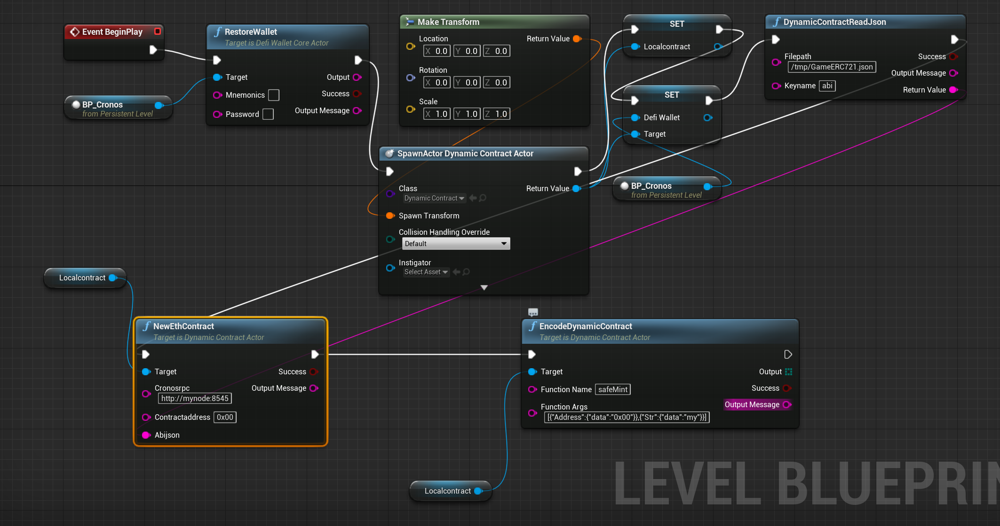

# Dynamic Contract 

with Dynamic Contract, you can call any smartcontract. you need abi json file for the contract.  
- create contract beforehand, prepare contract address 
- prepare abi json file for the contract to access


## Call
this is for non modifying contract call

<figure><figcaption></figcaption></figure>


## Send
this is for modifying contract call. it needs `DefiWalletCoreActor` to sign the transaction.

<figure><figcaption></figcaption></figure>


## Encode
this is for wallet-connect. it generates data which can be included in the transaction. and the transaction can be signed with wallet-connect
<figure><figcaption></figcaption></figure>


## For function arguments encoding
### Sample for safeMint
 - solidity function signature:
 ```
 safeMint(address,string)
 ```
- funciton name: 
```
safeMint
```
- function arguments: 
```
[{"Address":{"data":"0x00"}},{"Str":{"data":"my"}}]
```

### Sample for all types
```
[
  {
    "Address": {
      "data": "0x0000000000000000000000000000000000000000"
    }
  },
  {
    "FixedBytes": {
      "data": [
        1,
        2
      ]
    }
  },
  {
    "Bytes": {
      "data": [
        1,
        2
      ]
    }
  },
  {
    "Int": {
      "data": "1"
    }
  },
  {
    "Uint": {
      "data": "1"
    }
  },
  {
    "Bool": {
      "data": true
    }
  },
  {
    "Str": {
      "data": "test"
    }
  },
  {
    "FixedArray": {
      "data": [
        {
          "Int": {
            "data": "1"
          }
        }
      ]
    }
  },
  {
    "Array": {
      "data": [
        {
          "Int": {
            "data": "1"
          }
        }
      ]
    }
  },
  {
    "Tuple": {
      "data": [
        {
          "Int": {
            "data": "1"
          }
        }
      ]
    }
  }
]

```
